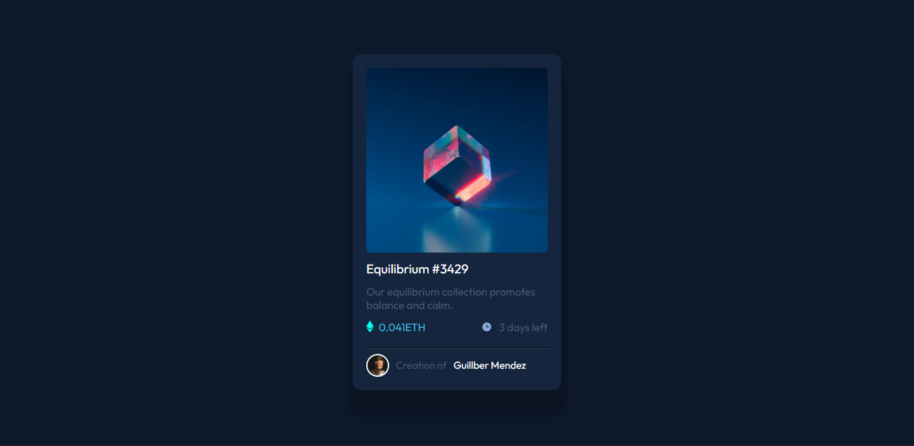
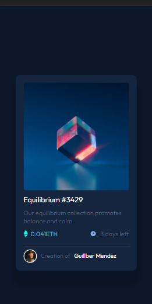

# Frontend Mentor - Solución del componente de la tarjeta de vista previa NFT

Esta es una solución al [reto de la tarjeta de vista previa NFT en Frontend Mentor](https://www.frontendmentor.io/challenges/nft-preview-card-component-SbdUL_w0U). Los retos de Frontend Mentor te ayudan a mejorar tus habilidades de codificación construyendo proyectos realistas. 

## Resumen

### El reto

Los usuarios deben ser capaces de:

- Ver el diseño óptimo en función del tamaño de la pantalla de su dispositivo
- Ver los estados hover de los elementos interactivos

### Captura de pantalla

### Links

- URL del sitio: [Live site URL here](https://guillmh.github.io/nftCardComponent/)

### Construido con

- Semantic HTML5 markup
- CSS custom properties
- Flexbox
- CSS Grid
- Sass

### Que aprendi

Aprendi conceptos basicos de HTML Y CSS, tambien sobre el procesador Sass, principalmnete la anidacion de clases.

### Continuar con el Desarrollo

Quiero seguir aprendido mas a fondo HTML y CSS para tener bases solidas, tambien quiero centrarme en hacer codigo mas ordenado y limpio es algo en lo que seguire trabjando.

### Recursos

- [hsl]https://www.freecodecamp.org/espanol/learn/responsive-web-design/applied-visual-design/adjust-the-hue-of-a-color - Esto ayudo a comprender mejor el funcionamiento de la propiedad hsl de CSS. 
- [box-shadow](https://www.freecodecamp.org/espanol/learn/responsive-web-design/applied-visual-design/add-a-box-shadow-to-a-card-like-element) - Me ayudo para comprender como funciona la propiedad box-shadow y como agregar esto a una tarjeta.
- [font-weight]https://www.freecodecamp.org/espanol/learn/responsive-web-design/applied-visual-design/set-the-font-weight-for-multiple-heading-elements - Esto ayudo para lograr hacer le texto mas grueso.
- [flexbox]https://css-tricks.com/snippets/css/a-guide-to-flexbox/ - Me ayudo a recordar algunas propiedades de flexbox y su funcionamiento de cada propiedad.

## Author
- Frontend Mentor - [@Guill-MH](https://www.frontendmentor.io/profile/Guill-MH)

